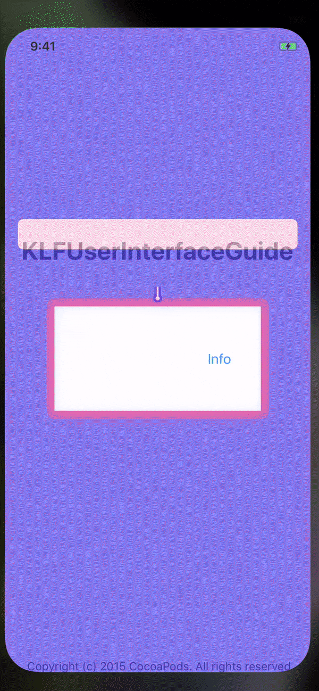

# KLFUserInterfaceGuide

[](https://travis-ci.org/jebelli.farhad@gmail.com/KLFUserInterfaceGuide)
[](https://cocoapods.org/pods/KLFUserInterfaceGuide)
[](https://cocoapods.org/pods/KLFUserInterfaceGuide)
[](https://cocoapods.org/pods/KLFUserInterfaceGuide)


## Description
Lightweight and easy to use iOS library to make the user familiar with your app.
It requires a view and a text and an optional tag so you won't have to worry about presentation next time, it will use the tag to set a flag on User Defaults. You can present it multiple times after each other, since it has a queueing mechanism and you will not get `UIViewController` presentation error.


  
## Installation

KLFUserInterfaceGuide is available through [CocoaPods](https://cocoapods.org). To install
it, simply add the following line to your Podfile:

```ruby
pod 'KLFUserInterfaceGuide'
```

## Usage

```swift
import KLFUserInterfaceGuide
```

On your `viewController` call `presentUserInterfaceGuide` function

Simplest way to use:
```swift 5.2
// view: The view you are going to show guide for
// message: The message to show also can be `NSAttributedString`
presentUserInterfaceGuide(view: self.subview, message: "This is very beginning message!!!")
```

Also provides some presentation options:
```swift
// tag: will force the guide to show once not providing tag will present the guide every time
// dismissWhenTapedOutside: default behavior forces user to tap inside the box set this property to true so the guide will dismiss by tapping outside.
// decision: is '(CGPoint) -> Bool' closure passes the touchpoint of user in coordinate of view if return true means touchpoints is where it should be and guide will dismiss if false noting happens
// completion: will call after the completion of `UIViewController.dismiss()` called 

self.presentUserInterfaceGuide(view: subView, message: "This is very begining message!!!", tag: "view1", dismissWhenTapedOutside: true,
decision: { point in
    if self.subView.frame.contains(point) {
        self.subviewTapped()
        return true
    }
    return false
}, completion: {
     subViewTapped()
})

```

## Configuration
You can set configuration everywhere but best place is `didFinishLaunchingWithOptions` in `AppDelegate`
```swift
func application(_ application: UIApplication, didFinishLaunchingWithOptions launchOptions: [UIApplication.LaunchOptionsKey: Any]?) -> Bool {
    
    var config = KLFUserInterfaceGuide.config

    //alpa of background of the guide
    config.alpha = 0.8
    //color of background of the guide
    config.background = .blue
    //margin of the box over the view
    config.rectMargin = 10
    //radius  of the box over the view
    config.rectRadius = 10
    //font of the message
    config.font = UIFont.systemFont(ofSize: 14)
    //alignment of the message
    config.textAlignment = .natural
    // bubble background
    config.bubbleBackgroundColor = .gray
    // bubble border
    config.bubbleBorderColor = .yellow
    // bubble message text
    config.bubbleTextColor = .cyan
    
    KLFUserInterfaceGuide.config = config
}
```

## Author

jebelli.farhad@gmail.com, jebelli.farhad@gmail.com

## License

KLFUserInterfaceGuide is available under the MIT license. See the LICENSE file for more info.
